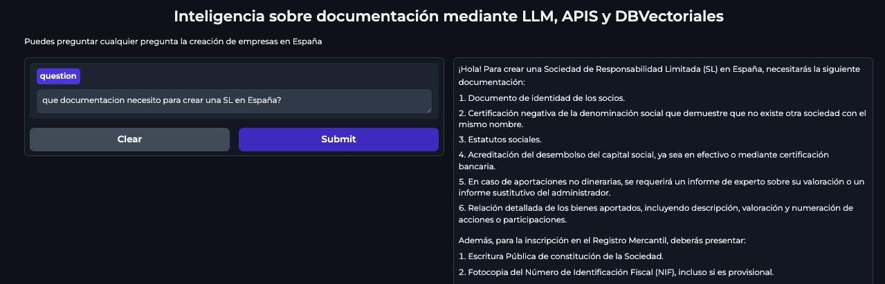

# OpenAI RAG Project

### Overview

The OpenAI RAG Project is designed to create an intelligent document retrieval system using state-of-the-art language models and vector databases. It leverages OpenAI's GPT-3.5 to provide accurate and contextual answers to questions related to business documentation in Spain. This project utilizes LangChain and Gradio for document loading, processing, and user interaction.

### Table of Contents

[Features](#Features)
[Installation](#Installation)
[Usage](#Usage)
[Technical Details](#Technical_Details)
[Contributing](#Contributing)
[License](#License)

### Features

- Intelligent Q&A: Answer questions based on multiple PDF documents related to business regulations and requirements in Spain.
- Document Retrieval: Efficiently retrieves and processes documents using a vector database for fast and accurate responses.
- User-Friendly Interface: Provides a Gradio interface for easy user interaction.
- Customizable Settings: Easily modify the model settings and document sources as needed.

### User Interface Overview

This screenshot showcases the user-friendly interface of our OpenAI RAG project, built using Gradio.
Users can easily interact with the application by typing their questions related to business documentation in Spain. 
The intuitive design allows for a seamless experience, enabling quick access to detailed and relevant information generated by the underlying language model.

 

### Installation

To set up the project, you will need to install the required dependencies. Run the following command:

```
pip install langchain langchain_openai gradio chromadb pypdf
If you are using the community version of LangChain, install it with:
```


pip install -U langchain-community

### Usage

1. Clone the repository to your local machine:

```
git clone https://github.com/yourusername/openai-rag-project.git
cd openai-rag-project
```

2. Open the Jupyter Notebook or your Python environment.

3. Load the necessary PDFs by updating the urls list in the script.

4. Run the code cells to set up the model and start the Gradio interface.

5. Use the interface to ask questions related to business documentation in Spain.

### Technical Details

- Language Model: Utilizes OpenAI's gpt-3.5-turbo-0125.
- Document Processing: PDFs are loaded using LangChain's PyPDFLoader and transformed into a vector format with OpenAI Embeddings.
- Database: Chroma is used to create a vector store for document retrieval.
- Prompt Design: Custom instructions are crafted to ensure that the model responds accurately and professionally.

### Example Query

To get started, you can ask:

```
What documentation is required to set up a Limited Liability Company (SL) in Spain?
```

### License

This project is licensed under the MIT License. See the LICENSE file for details.


### Author

- **Name**: Rosalía González Caviedes
- **Email**: rosaliagonzalezc@gmail.com
- [LinkedIn profile](https://www.linkedin.com/in/rosaliagonzalezcaviedes/)
- [Github profile](https://github.com/liagcaviedes)

### Contributing
We welcome contributions to this project! Please submit a pull request or open an issue if you have suggestions or improvements.